### IDEA的maven项目

这段时间在学习javaweb的一些知识，然后接触到了springmvc框架。框架的创建和配置一直是新手入门的一个难题，所以我就写一下我的配置过程，以供参考，另外因为spring4的新特性可以用Java来配置，网上相关资料较少，所以我参考了很多博文后，把xml和java两种配置方式都试了一下。   
工具准备：IDEA2016.3 Java jdk 1.8   
1、DEA创建项目   
新建一个maven project，并且选择webapp原型。  
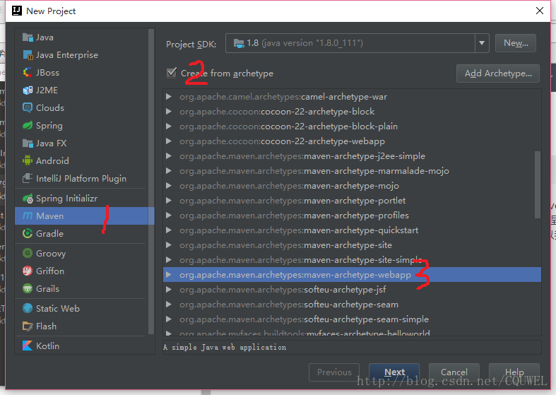 

然后点击next   
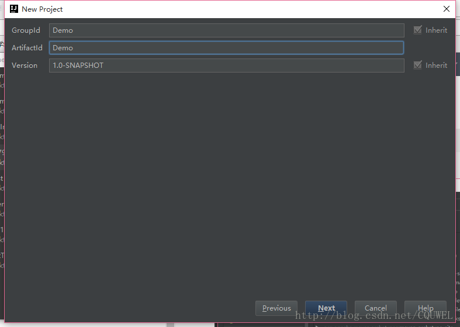 

  
这里的GroupId和ArtifactID随意填写，但是ArtifactID最好和你的项目一名一样然后next  
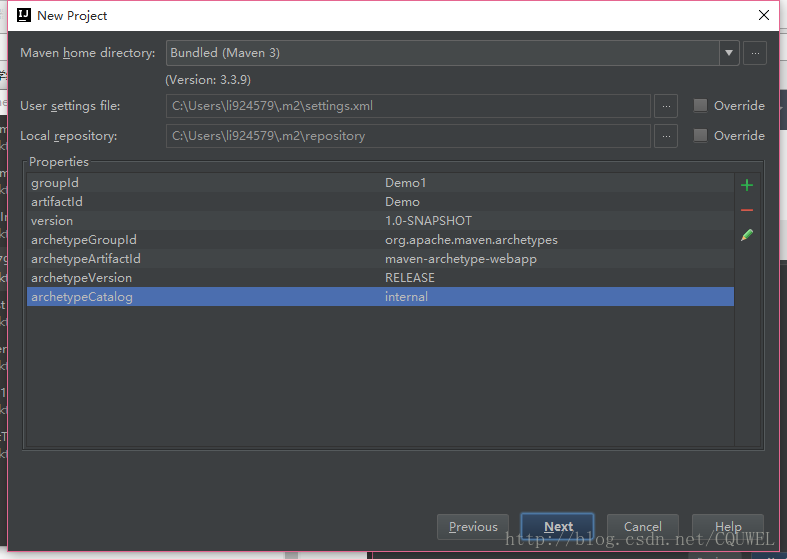 


为了快一点创建，我们添加一个属性值，如图中亮的所示，点右边的加号，name=archetypeCatalog value=internal。 
这里我们选择使用IDEA自带的maven，下面的两个分别是你的maven配置文件和你的仓库地址，我记得idea的maven一开始是没有setting.xml的，所以你要去maven的目录里面拷一份setting.xml到你的仓库中。idea的maven在安装路径的plugins文件夹下，即X:\xxx\JetBrains\IntelliJ IDEA 2016.3.2\plugins\plugins\maven\lib\maven3\conf\setting.xml拷贝到你的用户文件夹下的.m2文件夹下，为了之后能够快速的下载依赖包，我们要加一个官方库的镜像，因为maven的官方仓库在国外，太慢了。 
我们在你的.m2文件夹下的setting.xml中添加如下代码：
```$xslt
<mirror>
        <id>alimaven</id>
        <mirrorOf>central</mirrorOf>
        <name>aliyun maven</name>
      <url>http://maven.aliyun.com/nexus/content/repositories/central/</url>
</mirror>
``` 

具体位置如下图所示
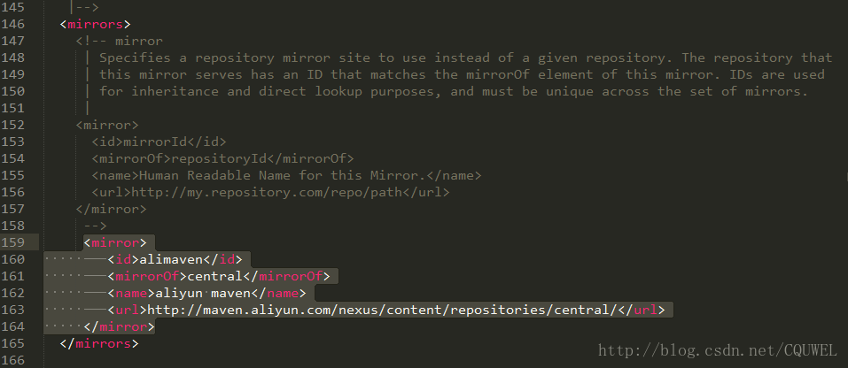 

这个是阿里的库，所以很快。做完之后我们回到idea，点击next，然后填写项目名，然后finish。 
接下来idea开始创建项目，这里你要把maven自动导入打开。

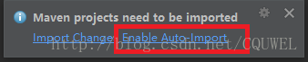 

然后等待maven创建项目成功


这样我们的项目初始的框架就弄好了。

2、添加pom依赖 
创建好之后的项目目录如图所示 
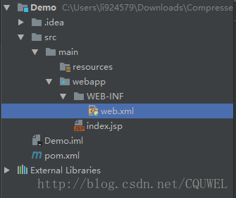


我们打开其中的pom.xml，添加我们的依赖。这里我把我的依赖全部放出来，复制到你的pom.xml的dependencies标签之间就可以了，pom文件中也会给你一个示例。 
我的依赖如下

```$xslt
<!--测试-->
    <dependency>
      <groupId>junit</groupId>
      <artifactId>junit</artifactId>
      <version>4.12</version>
      <scope>test</scope>
    </dependency>
    <!--日志-->
    <dependency>
      <groupId>org.slf4j</groupId>
      <artifactId>slf4j-log4j12</artifactId>
      <version>1.7.21</version>
    </dependency>
    <!--J2EE-->
    <dependency>
      <groupId>javax.servlet</groupId>
      <artifactId>javax.servlet-api</artifactId>
      <version>3.1.0</version>
    </dependency>
    <dependency>
      <groupId>javax.servlet.jsp</groupId>
      <artifactId>jsp-api</artifactId>
      <version>2.2</version>
    </dependency>
    <dependency>
      <groupId>javax.servlet</groupId>
      <artifactId>jstl</artifactId>
      <version>1.2</version>
    </dependency>
    <!--mysql驱动包-->
    <dependency>
      <groupId>mysql</groupId>
      <artifactId>mysql-connector-java</artifactId>
      <version>5.1.35</version>
    </dependency>
    <!--springframework-->
    <dependency>
      <groupId>org.springframework</groupId>
      <artifactId>spring-web</artifactId>
      <version>4.2.6.RELEASE</version>
    </dependency>
    <dependency>
      <groupId>org.springframework</groupId>
      <artifactId>spring-webmvc</artifactId>
      <version>4.2.6.RELEASE</version>
    </dependency>
    <dependency>
      <groupId>org.springframework</groupId>
      <artifactId>spring-context</artifactId>
      <version>4.2.6.RELEASE</version>
    </dependency>
    <dependency>
      <groupId>org.springframework</groupId>
      <artifactId>spring-test</artifactId>
      <version>4.2.6.RELEASE</version>
    </dependency>
      <dependency>
          <groupId>org.springframework</groupId>
          <artifactId>spring-jdbc</artifactId>
          <version>4.2.6.RELEASE</version>
      </dependency>
    <dependency>
      <groupId>com.github.stefanbirkner</groupId>
      <artifactId>system-rules</artifactId>
      <version>1.16.1</version>
      <scope>test</scope>
    </dependency>
    <dependency>
      <groupId>org.aspectj</groupId>
      <artifactId>aspectjweaver</artifactId>
      <version>1.8.9</version>
    </dependency>
    <!--其他需要的包-->
    <dependency>
        <groupId>org.apache.commons</groupId>
        <artifactId>commons-lang3</artifactId>
        <version>3.4</version>
    </dependency>
    <dependency>
        <groupId>commons-fileupload</groupId>
        <artifactId>commons-fileupload</artifactId>
        <version>1.3.1</version>
    </dependency>
```
 

一旦你复制过去之后，maven就会开始下载相应的jar文件，等待下载完成即可。可能包有点多，不过用了阿里的镜像之后还是挺快的。

3、添加框架支持 
配置完pom.xml之后，我们在idea中要添加一下框架的支持。 
右击我们的项目文件夹，选择add framework support 


然后在窗口中分别选中spring和springmvc，并且选择spring是，记得勾选springconfig.xml

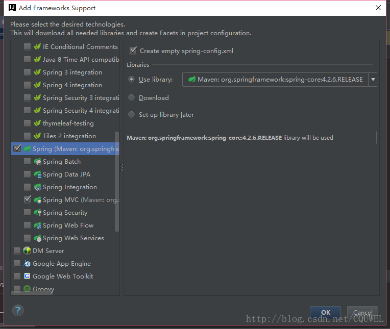


因为我们之前下载过相应的文件，所以这里直接用我们下载好的spring文件。 
点击ok之后，我们会发现WEB-INF文件夹下多出了两个文件 


这个就是我们之后要配置的文件，先不用管。

4、完善目录结构 
首先我们在src/main文件夹下创建java文件夹，你会发现这个文件夹不能创建java的类文件和package，别急，先把必须的文件夹全部创建好。请按照下图创建文件夹 
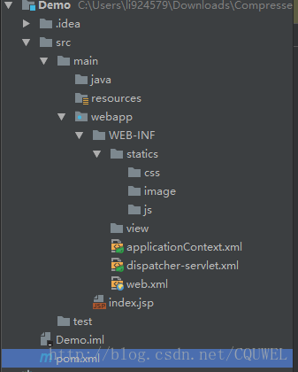

然后我们进入project structure选择文件夹的作用，在界面的右上角进入project structure

然后在module中选择设置各个模块，其中java文件夹是 sources，test是Test，改完之后，点ok，文件夹会变色，那就成功了。 
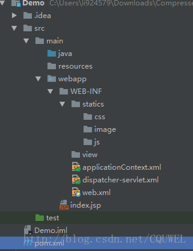

然后仔仔java文件夹中添加需要的包。最后的完整目录如下 
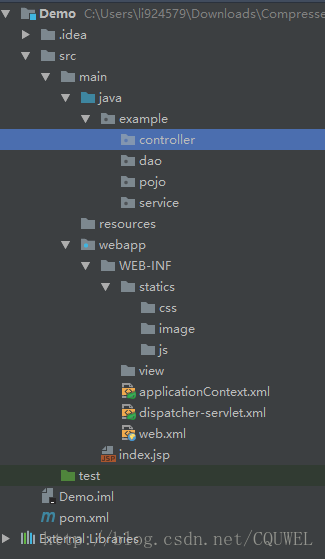


这样我们配置前的工作就完成了，接下来就是对springmvc进行配置。我把两种配置的方法分成两部分，以供参考。

5、基于XML 的配置

5.1、配置web.xml 
  idea创建的web.xml这个文件版本比较低，所以我们要找一个新的。把我的文件直接全部覆盖复制进去就可以了。

```$xslt
<?xml version="1.0" encoding="UTF-8"?>
<web-app xmlns="http://xmlns.jcp.org/xml/ns/javaee"
         xmlns:xsi="http://www.w3.org/2001/XMLSchema-instance"
         xsi:schemaLocation="http://xmlns.jcp.org/xml/ns/javaee http://xmlns.jcp.org/xml/ns/javaee/web-app_3_1.xsd"
         version="3.1">

    <display-name>Archetype Created Web Application</display-name>

    <!--welcome pages-->
    <welcome-file-list>
        <welcome-file>index.jsp</welcome-file>
    </welcome-file-list>

    <!--配置springmvc DispatcherServlet-->
    <servlet>
        <servlet-name>springMVC</servlet-name>
        <servlet-class>org.springframework.web.servlet.DispatcherServlet</servlet-class>
        <init-param>
            <!--配置dispatcher.xml作为mvc的配置文件-->
            <param-name>contextConfigLocation</param-name>
            <param-value>/WEB-INF/dispatcher-servlet.xml</param-value>
        </init-param>
        <load-on-startup>1</load-on-startup>
        <async-supported>true</async-supported>
    </servlet>
    <servlet-mapping>
        <servlet-name>springMVC</servlet-name>
        <url-pattern>/</url-pattern>
    </servlet-mapping>
    <!--把applicationContext.xml加入到配置文件中-->
    <context-param>
        <param-name>contextConfigLocation</param-name>
        <param-value>/WEB-INF/applicationContext.xml</param-value>
    </context-param>
    <listener>
        <listener-class>org.springframework.web.context.ContextLoaderListener</listener-class>
    </listener>
</web-app>
```
 

上面代码的意思主要就是创建一个中央的控制器，都有简单的注释，如果有需要，请自行百度。

5.2 配置dispatcher-servlet.xml 
  这个文件负责mvc的配置。

```$xslt
<?xml version="1.0" encoding="UTF-8"?>
<beans xmlns="http://www.springframework.org/schema/beans"
       xmlns:xsi="http://www.w3.org/2001/XMLSchema-instance"
       xmlns:context="http://www.springframework.org/schema/context"
       xmlns:mvc="http://www.springframework.org/schema/mvc"
       xsi:schemaLocation="http://www.springframework.org/schema/beans http://www.springframework.org/schema/beans/spring-beans.xsd http://www.springframework.org/schema/context http://www.springframework.org/schema/context/spring-context.xsd http://www.springframework.org/schema/mvc http://www.springframework.org/schema/mvc/spring-mvc.xsd">
    <!--此文件负责整个mvc中的配置-->

    <!--启用spring的一些annotation -->
    <context:annotation-config/>

    <!-- 配置注解驱动 可以将request参数与绑定到controller参数上 -->
    <mvc:annotation-driven/>

    <!--静态资源映射-->
    <!--本项目把静态资源放在了webapp的statics目录下，资源映射如下-->
    <mvc:resources mapping="/css/**" location="/WEB-INF/statics/css/"/>
    <mvc:resources mapping="/js/**" location="/WEB-INF/statics/js/"/>
    <mvc:resources mapping="/image/**" location="/WEB-INF/statics/image/"/>

    <!-- 对模型视图名称的解析，即在模型视图名称添加前后缀(如果最后一个还是表示文件夹,则最后的斜杠不要漏了) 使用JSP-->
    <!-- 默认的视图解析器 在上边的解析错误时使用 (默认使用html)- -->
    <bean id="defaultViewResolver" class="org.springframework.web.servlet.view.InternalResourceViewResolver">
        <property name="viewClass" value="org.springframework.web.servlet.view.JstlView"/>
        <property name="prefix" value="/WEB-INF/views/"/><!--设置JSP文件的目录位置-->
        <property name="suffix" value=".jsp"/>
        <property name="exposeContextBeansAsAttributes" value="true"/>
    </bean>

    <!-- 自动扫描装配 -->
    <context:component-scan base-package="example.controller"/>
</beans>
```
 

直接复制即可，都有注释，如果有需要，请自行百度。

5.3、 配置applicationContext.xml 
 其实这个文件没什么好配置的，这个文件主要负责一些非mvc组件（或者其他组件）的配置，暂时没有，所以是空的，但你也可以扫描一下。

```$xslt
<?xml version="1.0" encoding="UTF-8"?>
<beans xmlns="http://www.springframework.org/schema/beans"
       xmlns:xsi="http://www.w3.org/2001/XMLSchema-instance"
       xmlns:context="http://www.springframework.org/schema/context"
       xsi:schemaLocation="http://www.springframework.org/schema/beans http://www.springframework.org/schema/beans/spring-beans.xsd http://www.springframework.org/schema/context http://www.springframework.org/schema/context/spring-context.xsd">
    <context:component-scan base-package="example"/>
</beans>
```
 

5.4、 测试 
 三个配置文件配置好之后，就可以测试了。首先在controller文件夹下创建一个IndexController，代码如下：

```$xslt
@Controller
@RequestMapping("/home")
public class IndexController {

    @RequestMapping("/index")
    public String index() {
        return "index";
    }
}
```
 

views文件夹下创建index.jsp，statics/css/下创建test.css

```$xslt
<%@ taglib prefix="c" uri="http://java.sun.com/jsp/jstl/core" %>
<%@ page contentType="text/html;charset=UTF-8" language="java" %>
<html>
<head>
    <title>Index</title>
    <link rel="stylesheet" type="text/css" href="<c:url value="/css/test.css"/> "/>
</head>
<body>
<p>Spring MVC based on XML config success!</p>
</body>
</html>
```
 
```$xslt
p
{
    background-color: brown;
    font-family: "Courier New";
    font-size:100px;
}
```
 

接下来配置tomcat，如果没有，去官网下载tomcat7以上的版本。   
右上角   

 
然后选择tomcat 
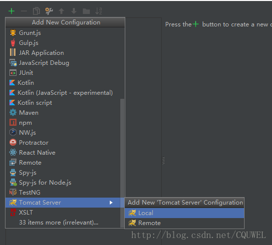

配置相关信息 
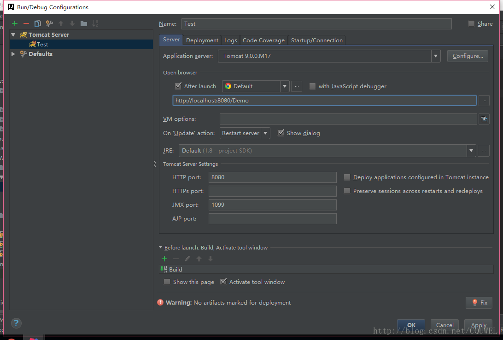
 
还有deployment 

 
选择第二个 
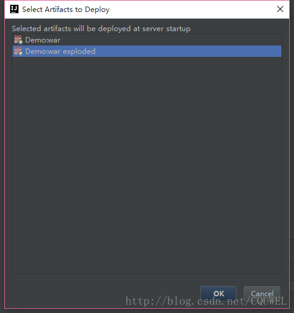
 
这里的名称和项目名一样。 
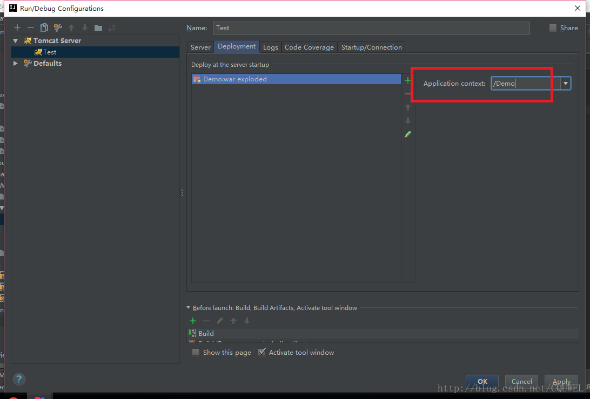
 
然后点击ok完成。

最后运行tomcat，在浏览器输入http://localhost:8080/Demo/home/index 即可。 
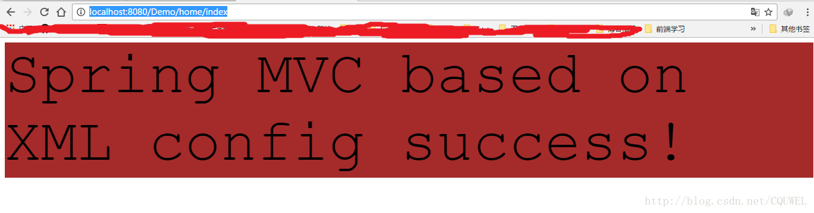
 
运行成功。

6、基于Java配置 
java配置也是参考spring in action 第四版这个书，所以具体的原理不去详解，所以我这里更加倾向于把java配置和xml配置中的相同功能的部分进行比较，也是能对java配置又以有一个更加直观的认识。 
首先我们先完成准备工作，也就是本文的前四个直到文件目录完成，但是目录需要一点小的修改，因为多了配置类，如下图。 

 
可以看到我们多了一个config包，这个里面就是放配置类的。

6.1 、去除web.xml 
web.xml里面的内容可以删掉了。 
在config中创建WebXml类

```$xslt
public class WebXml extends AbstractAnnotationConfigDispatcherServletInitializer {
    /*
     <context-param>
         <param-name>contextConfigLocation</param-name>
         <param-value>/WEB-INF/applicationContext.xml</param-value>
     </context-param>
     <listener>
         <listener-class>org.springframework.web.context.ContextLoaderListener</listener-class>
     </listener>
      */
    @Override
    protected Class<?>[] getRootConfigClasses() {
        return new Class<?>[] {ApplicationContextXml.class};
    }

    /*
    <servlet>
        <servlet-name>springMVC</servlet-name>
        <servlet-class>org.springframework.web.servlet.DispatcherServlet</servlet-class>
        <init-param>
            <!--配置dispatcher.xml作为mvc的配置文件-->
            <param-name>contextConfigLocation</param-name>
            <param-value>/WEB-INF/dispatcher-servlet.xml</param-value>
        </init-param>
        <load-on-startup>1</load-on-startup>
        <async-supported>true</async-supported>
    </servlet>
     */
    @Override
    protected Class<?>[] getServletConfigClasses() {
        return new Class<?>[] {DispatcherServletXml.class};
    }

    /*
    <servlet-mapping>
        <servlet-name>springMVC</servlet-name>
        <url-pattern>/</url-pattern>
    </servlet-mapping>
     */
    @Override
    protected String[] getServletMappings() {
        return new String[] {"/"};
    }
}
```
 

6.2、去除dispatcher-servle.xml

```$xslt
@Configuration
@EnableWebMvc
@ComponentScan("web.example.controller")
public class DispatcherServletXml extends WebMvcConfigurerAdapter{
    /*
    <bean id="defaultViewResolver" class="org.springframework.web.servlet.view.InternalResourceViewResolver">
        <property name="viewClass" value="org.springframework.web.servlet.view.JstlView"/>
        <property name="prefix" value="/WEB-INF/views/"/><!--设置JSP文件的目录位置-->
        <property name="suffix" value=".jsp"/>
        <property name="exposeContextBeansAsAttributes" value="true"/>
    </bean>
     */
    @Bean
    public ViewResolver viewResolver() {
        InternalResourceViewResolver resolver = new InternalResourceViewResolver();
        resolver.setViewClass(org.springframework.web.servlet.view.JstlView.class);
        resolver.setPrefix("/WEB-INF/views/");
        resolver.setSuffix(".jsp");
        resolver.setExposeContextBeansAsAttributes(true);
        return resolver;
    }

    @Override
    public void configureDefaultServletHandling(DefaultServletHandlerConfigurer configurer) {
        configurer.enable();
        super.configureDefaultServletHandling(configurer);
    }
    // 静态资源配置
    /*
    <mvc:resources mapping="/css/**" location="/WEB-INF/statics/css/"/>
    <mvc:resources mapping="/js/**" location="/WEB-INF/statics/js/"/>
    <mvc:resources mapping="/image/**" location="/WEB-INF/statics/image/"/>
     */
    @Override
    public void addResourceHandlers(ResourceHandlerRegistry registry) {
        registry.addResourceHandler("/css/**").addResourceLocations("/WEB-INF/statics/css/");
        registry.addResourceHandler("/js/**").addResourceLocations("/WEB-INF/statics/js/");
        registry.addResourceHandler("/image/**").addResourceLocations("WEB-INF/statics/image/");
        super.addResourceHandlers(registry);
    }
}
```
 

6.3、去除applicationContext.xml

```$xslt
@Configuration
@ComponentScan(basePackages = {"web"},
        excludeFilters = {
                @ComponentScan.Filter(type = FilterType.ANNOTATION, value = EnableWebMvc.class)
        })
public class ApplicationContextXml {
}

    1
```
 

上面三个配置类中的每一个设置我都对应的给出了原xml文档中的对应部分，两边对照着看，应该很容易理解。 
然后按照之前的测试方法，测试成功

 

7、 结束语 
以上的都是我边写边进行配置的，如果说的有什么错误，希望指正，毕竟我还是个新手，配置成功的项目我已经上传，以方便参考。链接：


### 参考
[IDEA中创建maven web项目的详细部署](https://www.cnblogs.com/1314wamm/p/7475771.html)  
[使用IntelliJ IDEA 配置Maven（入门）](https://www.cnblogs.com/sigm/p/6035155.html)  
[IntelliJ IDEA配置maven](https://blog.csdn.net/double_sweet1/article/details/79780308)  
[Maven环境配置及idea建Maven工程](https://blog.csdn.net/qq_37497322/article/details/78988378)      
[IDEA用maven创建springMVC项目和配置](https://www.cnblogs.com/shang-shang/p/7477607.html)  