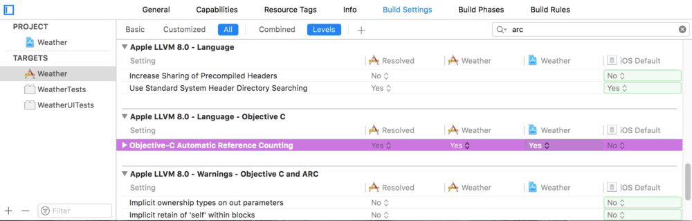
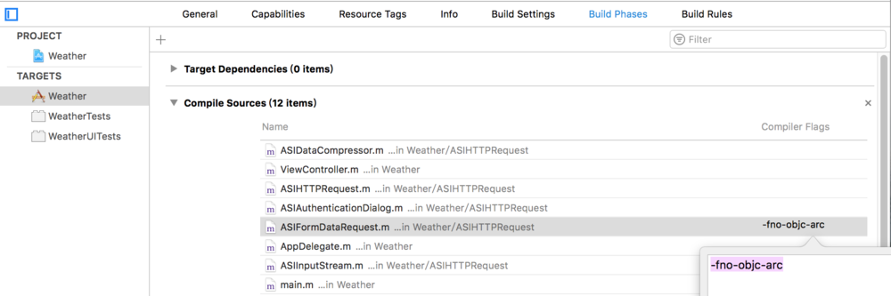
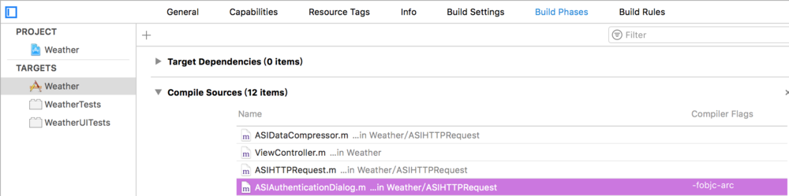

## MRC和ARC

#### 全局设置工程ARC或者MRC
选中 Target， 在 Objective C language 地方，将 ARC 设为 YES 或 NO。 这是一个总开关。 如有特别的文件， 可以单独加上开关。  

#### 设置单个文件ARC/MRC
在编译选项中，为MRC的程序添加-fno-objc-arc标记，表明在编译时，该文件使用MRC编译  
在targets的build phases选项下Compile Sources下选择是否使用arc编译的文件，双击，输入-fno-objc-arc / -fobjc-arc  
-fno-objc-arc ： MRC  
-fobjc-arc ：ARC  

设置单个文件为MRC  

设置单个文件为ARC  

#### 参考
[Xcode --- ARC和MRC的设置](https://www.jianshu.com/p/2b10f9fa6858)  
[XCode 中ARC和MRC设置](https://www.jianshu.com/p/89807c25ae13)  
