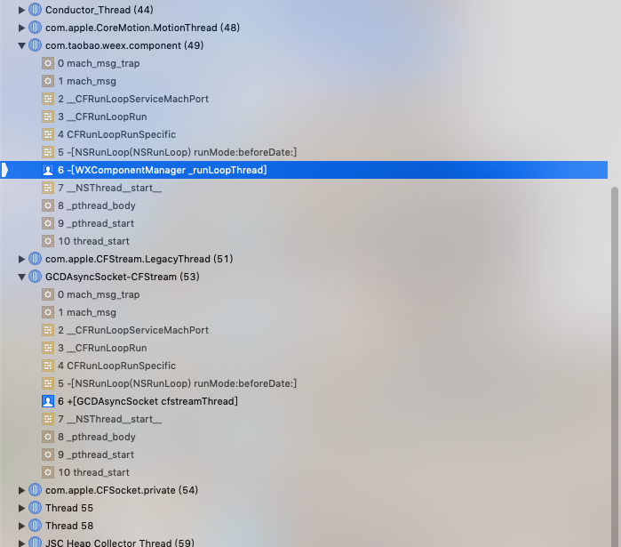

## 深入理解OC-NSRunLoop

#### Run Loop 基本概念
`Run Loop`就是一个在线程(thread)里不停执行的do-while循环。当线程接收到事件(event)时，Run Loop 内的事件处理会使用对应的句柄(handler)处理事件。

Run Loop 接受的事件可分为两种不同的源(source)，`Input source`传递异步事件，通常是其他线程或应用发送过来的消息(message)。`Timer sources`传递同步事件，即发生于特定时间的或以一定时间间隔循环发送的事件。

#### Run Loop 与线程的关系
Run Loop 与线程是一一对应的关系。每一个线程都有且仅有一个 Run Loop 与其对应，没有线程，就没有 Run Loop。在iOS应用中，主线程的 Run Loop 是默认启动的，而其他线程的 Run Loop 默认是不启动的。苹果为我们提供了两种获取 Run Loop 对象的方式：

使用[NSRunLoop currentRunLoop]获取NSRunLoop对象

使用CFRunLoopGetCurrent函数获取CFRunLoopRef

获取的 Run Loop 对象的线程安全性取决于你所使用的API。Core Foundation 中的函数通常是线程安全的，可以从任何线程调用。但是，如果你正在执行修改 Run Loop 配置的操作，那么最佳实践是尽可能在 Run Loop 所在的线程进行这些操作。

NSRunLoop类不具有线程安装性。如果你使用NSRunLoop类来修改 Run Loop，则应仅从持有该 Run Loop 的线程内执行操作。

#### Run Loop 的组成部分

### Run Loop遇到的错误
 

#### 参考
[《iOS面试之道》读书笔记 - NSRunLoop](https://www.jianshu.com/p/4edcb2ab18d4)  
[深入理解RunLoop](https://blog.ibireme.com/2015/05/18/runloop/)  
[iOS RunLoop详解](https://www.jianshu.com/p/b80a8d4484e6)

[iOS - RunLoop 底层源码详解及具体运用](https://www.jianshu.com/p/d6c5c0bf97fd)  
[Run Loop 记录与源码注释]( https://github.com/Desgard/iOS-Source-Probe/blob/master/Objective-C/Foundation/Run%20Loop%20记录与源码注释.md)  
[iOS RunLoop完全指南](http://www.voidcn.com/article/p-bctwptxv-bry.html)  
[iOS RunLoop详解](https://www.jianshu.com/p/23e3ff9619c3)  
[iOS-RunLoop充满灵性的死循环](https://blog.csdn.net/qq_30513483/article/details/52582482)  

[- (BOOL)runMode:(NSString *)mode beforeDate:(NSDate *)limitDate 方法 详解](https://blog.csdn.net/wjsxiaoweige/article/details/38318733)  
[iOS runloop 详解3 子线程runloop的启动与停止](https://blog.csdn.net/jeffasd/article/details/52023195)  
[objective-c - csm在 runMode:beforeDate 期间崩溃：](https://ask.helplib.com/objective-c/post_1364200)  

