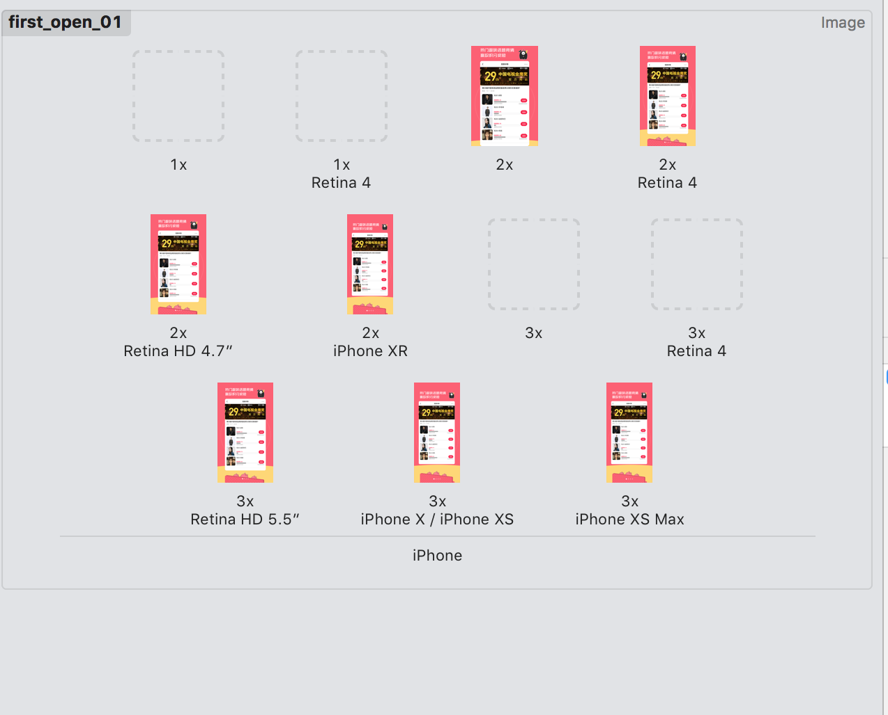
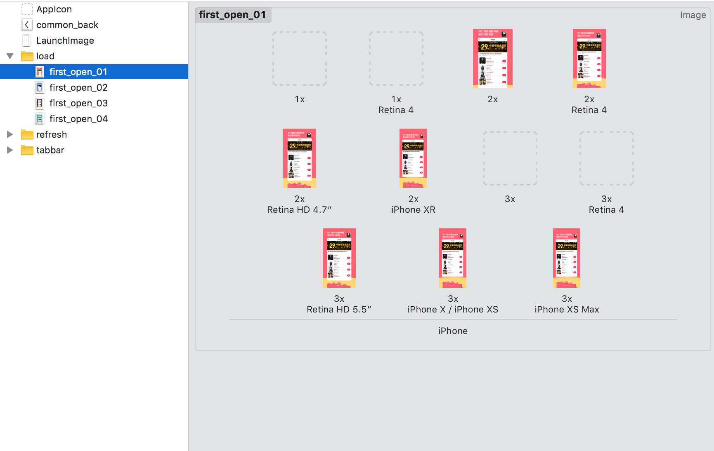

## iOS图片适配


方法1：
根据每款手机的分辨率来选择需要的图片尺寸  
```
if(分辨率1){
图片1
}else if(分辨率2){
图片2
}else if(分辨率3){
图片3
} .....
```

这种方式可以确实可以解决问题，就是太麻烦，太多的ifelse逻辑代码  

方法2：
使用Assets.xcassets来管理引导页图片，将指定分辨率的图片放入指定的位置，使用时只需要拿到图片名，图片会根据分辨率自动选取匹配的图片 有点像@2x @3x图片自动管理机制  
具体实现有以下几个步骤：  
1.创建一个LaunchImage类型的图片集合  
2.将创建的LaunchImage.launchimage从命名为first_open_01.imageset  
3.根据分辨率将指定图片拖入到指定位置  



4.由于有引导页有多张图片，可以使用同样方法创建多个first_open_02.imageset，first_open_03.imageset，


对应尺寸这里绘制了一张表(markdown格式)：

| 尺寸	| 分辨率	| scale	| 型号	| 对应机型 |
| ------ | ------ | ------ | ------ | ------ |
| 3.5''	| 640x960	| @2x	| 2x	| iPhone4及其以下 | 
| 4.0''	| 640×1136	| @2x	| Retina 4	| iPhone5/iPhone5s/iPhoneSE | 
| 4.7''	| 750×1334	| @2x	| Retina 4.7''	| iPhone6/iPhone6s/iPhone7/iPhone7s/iPhone8/iPhone8s | 
| 5.5''	| 1242×2208	| @3x	| Retina 5.5''	| iPhone6P/iPhone7P/iPhone8P | 
| 5.8''	| 1125×2436	| @3x	| iPhone X/iPhone XS	| iPhoneX/iPhoneXs | 
| 6.1''	| 828x1792	| @2x	| iPhoneXR	| iPhoneXR | 
| 6.5''	| 1242x2688	| @3x	| iPhoneX Max	| iPhoneX Max | 

swift版本引导页代码如下：

```
//
//  HXQNewFeaturesVC.swift
//  t1
//
//  Created by Tiny on 2018/10/25.
//  Copyright © 2018年 hxq. All rights reserved.
//  版本新特性

import UIKit

class HXQNewFeaturesVC: HXQBaseVC {

    var scrollView = UIScrollView()
    lazy var skipBtn:UIButton = {
        let skipBtn = UIButton()
        skipBtn.backgroundColor = UIColor(white:0, alpha: 0.3)
        skipBtn.setTitle("跳过", for: .normal)
        skipBtn.setTitleColor(.white, for: .normal)
        skipBtn.titleLabel?.font = UIFont.systemFont(ofSize: 14)
        skipBtn.layer.cornerRadius = 15
        skipBtn.layer.masksToBounds = true
        skipBtn.layer.borderColor = UIColor.white.cgColor
        skipBtn.layer.borderWidth = 1.0
        skipBtn.addTarget(self, action: #selector(jumpToRoot), for: .touchUpInside)
        
        return skipBtn
    }()
    
    override func viewDidLoad() {
        super.viewDidLoad()

        setupUI()
    }
    
    func setupUI(){
     
        scrollView.backgroundColor = .white
        scrollView.showsHorizontalScrollIndicator = false
        scrollView.isPagingEnabled = true
        scrollView.bounces = false
        view.addSubview(scrollView)
        scrollView.snp.makeConstraints { (make) in
            make.edges.equalToSuperview()
        }
        
        //5张图片
        var last:UIImageView? = nil
        for i in 0..<4 {
            let imgView = UIImageView()
            imgView.image = UIImage(named: "first_open_0\(i+1)")
            scrollView.addSubview(imgView)
            imgView.snp.makeConstraints { (make) in
                if last == nil{
                    make.left.equalToSuperview()
                }else{
                    make.left.equalTo(last!.snp.right)
                }
                make.width.equalToSuperview()
                make.height.equalToSuperview()
                make.top.equalToSuperview()
            }
            last = imgView
        }
        //更新scrollView contentSize
        scrollView.snp.remakeConstraints { (make) in
            make.top.bottom.left.equalToSuperview()
            make.right.equalTo(last!.snp.right)
        }
        
        //设置跳过button
        view.addSubview(skipBtn)
        skipBtn.snp.makeConstraints { (make) in
            make.top.equalToSuperview().offset(30)
            make.right.equalToSuperview().offset(-30)
            make.size.equalTo(CGSize(width: 60, height: 30))
        }
    }
    
    @objc func jumpToRoot(){
        //拿到当前的delegate
        guard let window = UIApplication.shared.delegate?.window else{
            fatalError("获取window失败")
        }
        window?.rootViewController = ViewController()
    }
}
```


### 参考
[iOS 新手引导页图片适配及其尺寸大全](https://www.cnblogs.com/qqcc1388/p/9895346.html)


